# 🏆 SportsApp

> Full-stack sports tracking application for leagues, teams, players, and live matches — inspired by Flashscore.

    

## 🌐 Live Demo

**[sports-app-beryl.vercel.app](https://sports-app-beryl.vercel.app)**

| Role | Email | Password |
|------|-------|----------|
| Admin | admin@gmail.com | admin123 |
| User | register a new account | — |

---

## 📖 About

SportsApp is a comprehensive sports tracking platform built with **Spring Boot 4** and **Angular 21**. It allows users to browse leagues, teams, players, and matches across multiple sports with **automatic standings calculation** using sport-specific rules.

The application features role-based access control with JWT authentication, allowing administrators to manage all entities through a dedicated admin panel, while regular users can browse content, mark favorites, and search globally across the platform.

---

## Screenshots

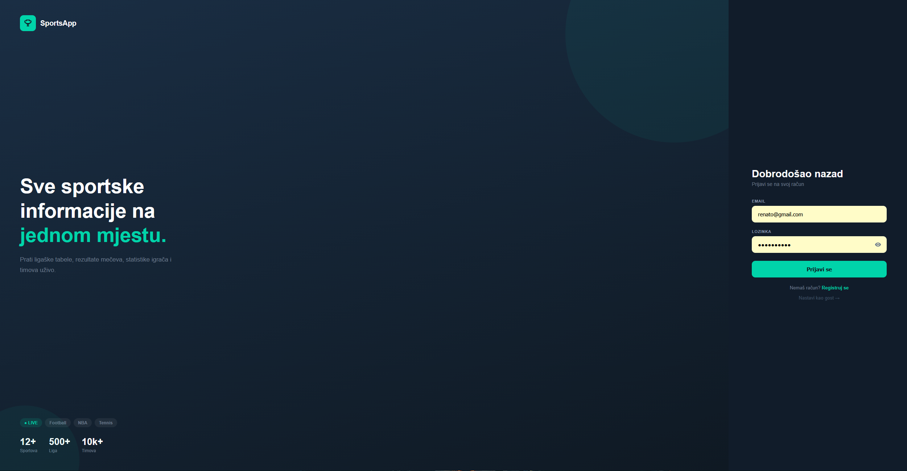
*Login page — sign in, register, or continue as guest*

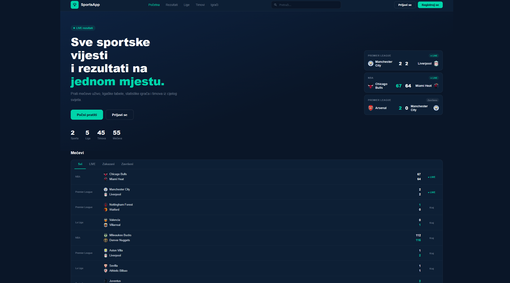
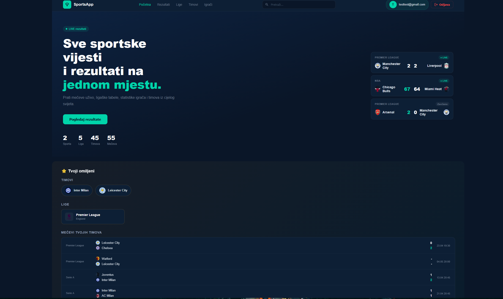
*Landing page — featured matches and personalized favorites section when user logged in*

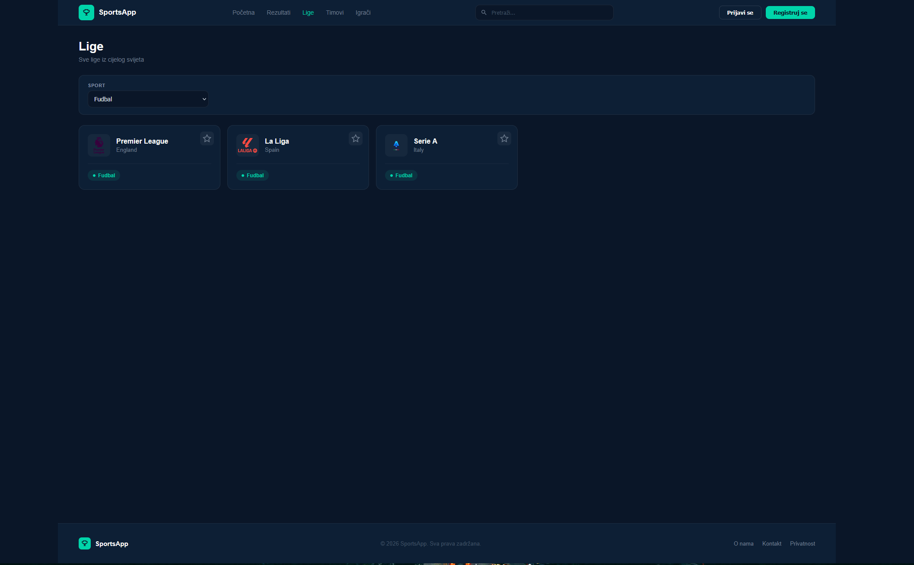
*Leagues — filter by sport, toggle favorites only if logged in*

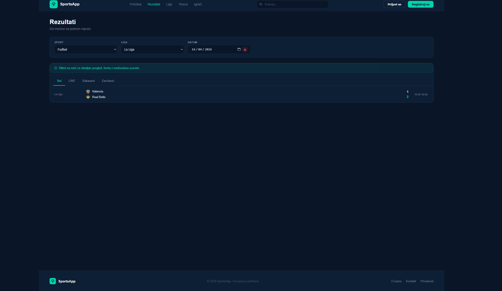
*Matches — filter by sport, league, status and date*

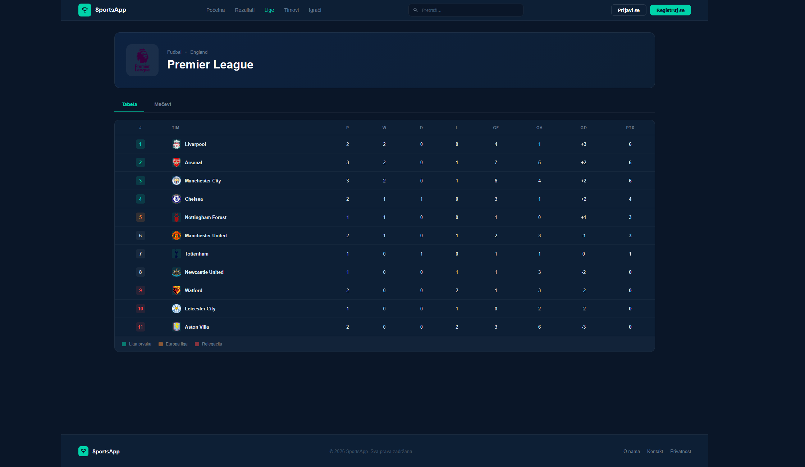
*Football standings — Champions League (green), Europa League (orange), Relegation (red)*

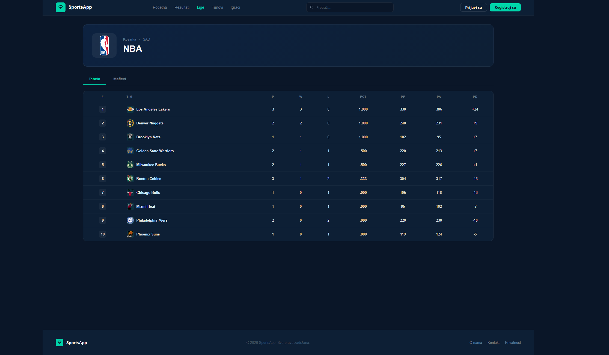
*NBA standings — different columns (PCT, PF, PA) because basketball scores differently*

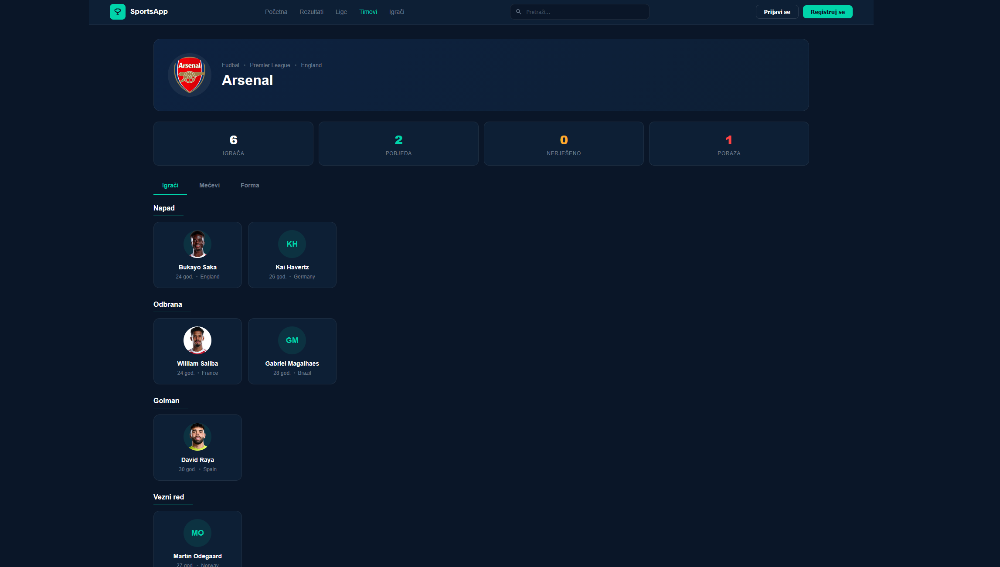
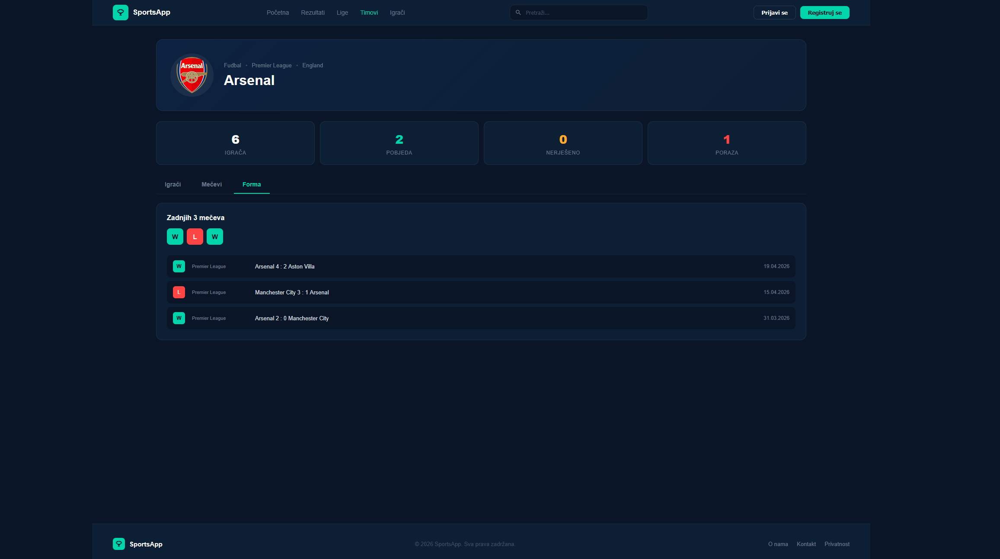
*Team detail — full roster grouped by position and recent form*

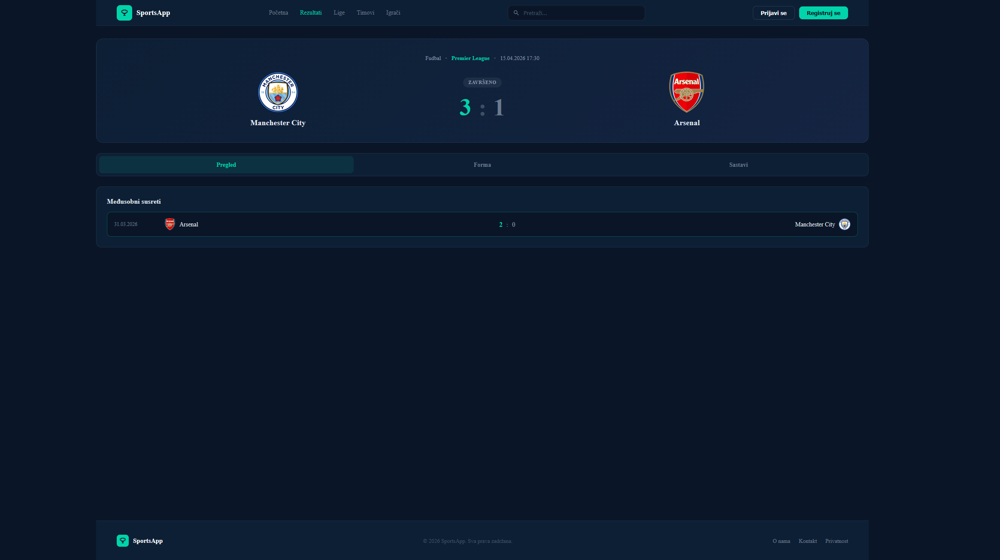
*Match detail — head-to-head history, team form (W/D/L), full rosters*

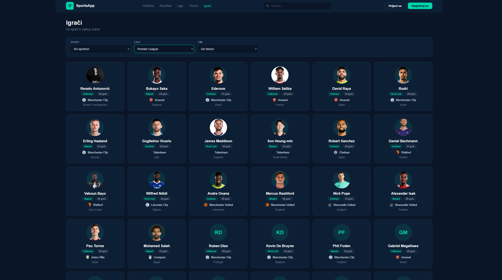
*Players — browse with sport, league and team filters*

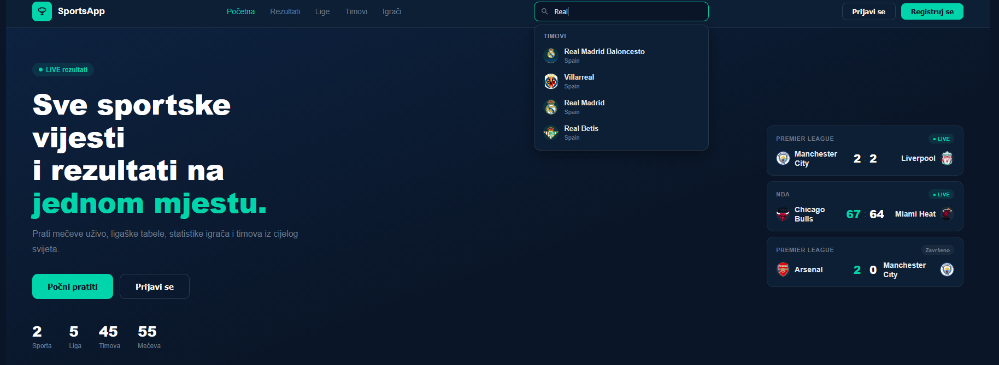
*Global search — live autocomplete grouped by teams, leagues, players*

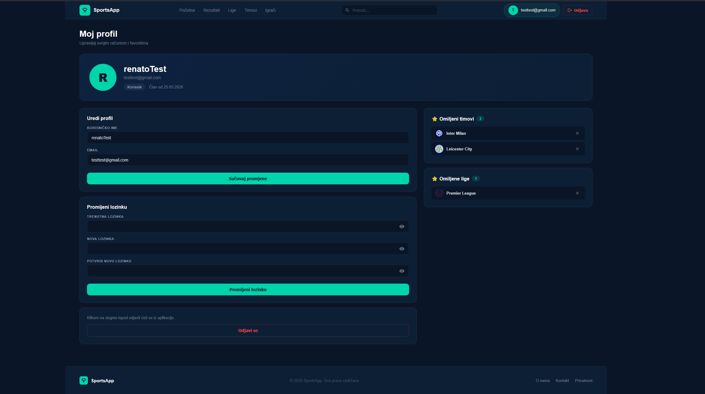
*User profile — edit info, manage favorites, change password*

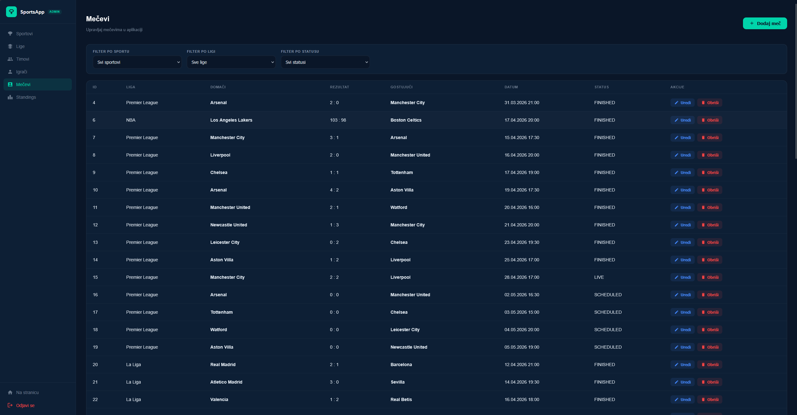
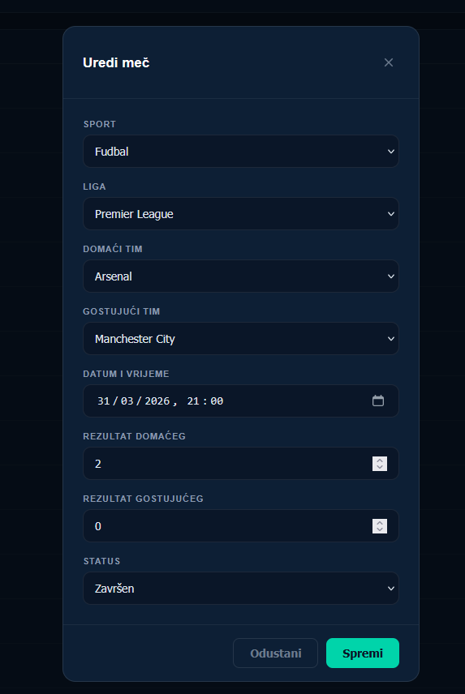
*Admin panel — full CRUD with cascading filters*

---

## ✨ Features

### Public Features (Guests + Users)
- **Browse leagues, teams, players, and matches** across multiple sports
- **Match details** with head-to-head history and recent team forms
- **League standings** with automatic calculation based on sport type
- **Date filtering** on matches with calendar picker
- **Global search** with live autocomplete grouped by entity type
- **Sport-specific position grouping** (e.g., Goalkeeper → Defense → Midfield → Attack for football)

### User Features (Authenticated)
- **JWT-based authentication** with email and password
- **Favorites system** for teams and leagues with persistent storage
- **"My favorites only" filter** on leagues and teams pages
- **Personalized landing page** showing favorite teams' upcoming matches
- **Profile management** — edit username, email, change password (with show/hide toggle)
- **Toast notifications** for actions (favorited, removed, errors)

### Admin Features (Role: ADMIN)
- **Full CRUD** for sports, leagues, teams, players, matches
- **Hierarchical filters** — sport → league → team
- **Cascading dropdowns** in forms (selecting sport filters available leagues, etc.)
- **Sport-specific position mapping** when creating players
- **Match validation** — enforces logical rules (e.g., a SCHEDULED match can't have scores, FINISHED can't be in the future)
- **Automatic standings regeneration** after any match create/update/delete

---

## 🛠 Tech Stack

### Backend
- **Java 21** with **Spring Boot 4.0**
- **Spring Security** with **JWT** authentication
- **Spring Data JPA** with **Hibernate 7**
- **PostgreSQL 18** as database
- **Lombok** for boilerplate reduction
- **Springdoc OpenAPI** for Swagger documentation
- **BCrypt** for password hashing

### Frontend
- **Angular 21** (standalone components, signals)
- **TypeScript** with strict mode
- **RxJS** for reactive programming
- **Custom CSS** (no UI library — fully custom dark theme)
- **JWT interceptor** for automatic token attachment

### Tools
- **IntelliJ IDEA** for backend
- **VS Code** for frontend
- **pgAdmin 4** for database management
- **Postman / Swagger UI** for API testing
- **Git + GitHub** for version control

---

## 📚 API Documentation

After starting the backend, Swagger UI is available at:

**http://localhost:8080/swagger-ui.html**

### Main Endpoints

| Method | Endpoint | Auth | Description |
|--------|----------|------|-------------|
| POST | `/api/auth/register` | Public | Register new user |
| POST | `/api/auth/login` | Public | Login and get JWT |
| GET | `/api/sports` | Public | List all sports |
| GET | `/api/leagues` | Public | List all leagues |
| GET | `/api/teams` | Public | List all teams |
| GET | `/api/matches` | Public | List all matches |
| POST | `/api/matches` | ADMIN | Create match (auto-regenerates standings if match is finished) |
| GET | `/api/standings/league/{id}` | Public | Get standings for league |
| GET | `/api/favorites/teams` | USER | Get user's favorite teams |
| POST | `/api/favorites/teams/{id}` | USER | Toggle favorite team |
| PUT | `/api/users/me` | USER | Update own profile |

---

## Getting Started

**Requirements:** Java 21+, Node.js 18+, PostgreSQL 18+, Maven 3.8+

### 1. Clone the repository
Download or clone from GitHub:
`git clone https://github.com/RenatoAntunovic/SportsApp.git`

### 2. Set up the database
Open **pgAdmin**, create a new database called `sportsapp`, then right-click on it → **Restore** → select `database/sportsapp_dump.sql`. This loads all tables and pre-populated data automatically.

### 3. Run the backend
Open `sportsapp-backend` in **IntelliJ IDEA** and edit `src/main/resources/application.properties`:
spring.datasource.url=jdbc:postgresql://localhost:5432/sportsapp
spring.datasource.username=YOUR_POSTGRESQL_USERNAME
spring.datasource.password=YOUR_POSTGRESQL_PASSWORD
jwt.secret=ANY_RANDOM_STRING_MIN_32_CHARACTERS

- **username / password** — your local PostgreSQL credentials (set when you installed PostgreSQL)
- **jwt.secret** — any random string, at least 32 characters long (e.g. `mysecretkey12345678901234567890ab`)

Then run `SportsappApplication`. Backend starts at `http://localhost:8080`.

### 4. Run the frontend
Open `sportsapp-frontend` in **Visual Studio Code**, open the terminal and run:

`npm install` then `ng serve`

Frontend starts at `http://localhost:4200`.

| Role | Email | Password |
|------|-------|----------|
| Admin | admin@gmail.com | admin123 |
| User | register a new account | — |

---

## 🔮 Future Improvements

Features planned for upcoming iterations:

- [ ] **WebSocket integration** for real-time match score updates
- [ ] **Player detail page** with statistics and career data
- [ ] **Advanced statistics** — top scorers, league leaders, season stats
- [ ] **Mobile app** with Flutter sharing the same backend

## 📄 License

This project is licensed under the MIT License - see the LICENSE file for details..
